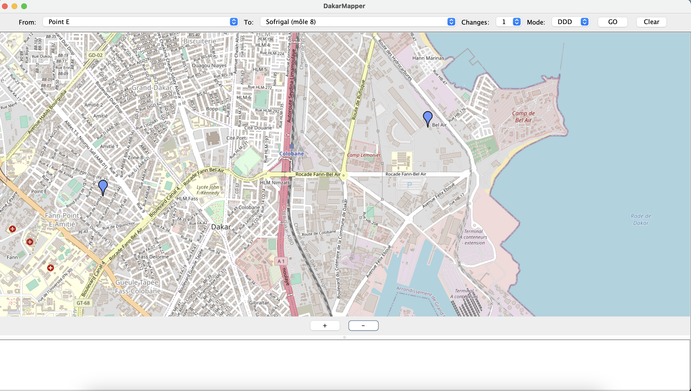
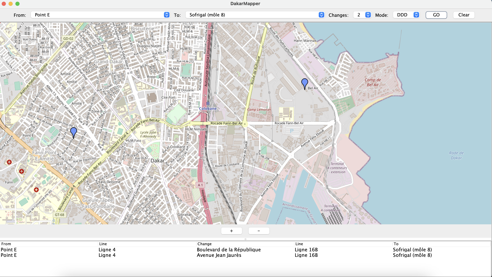
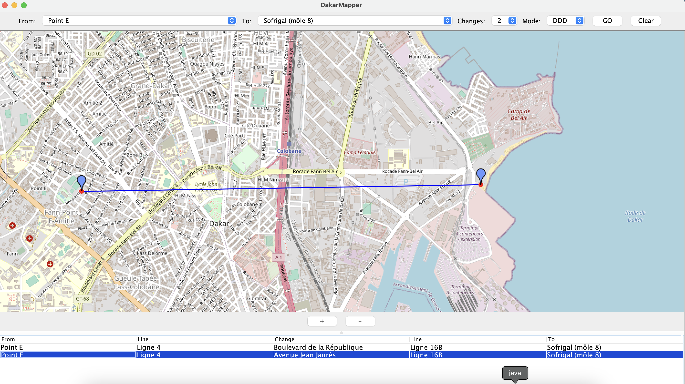
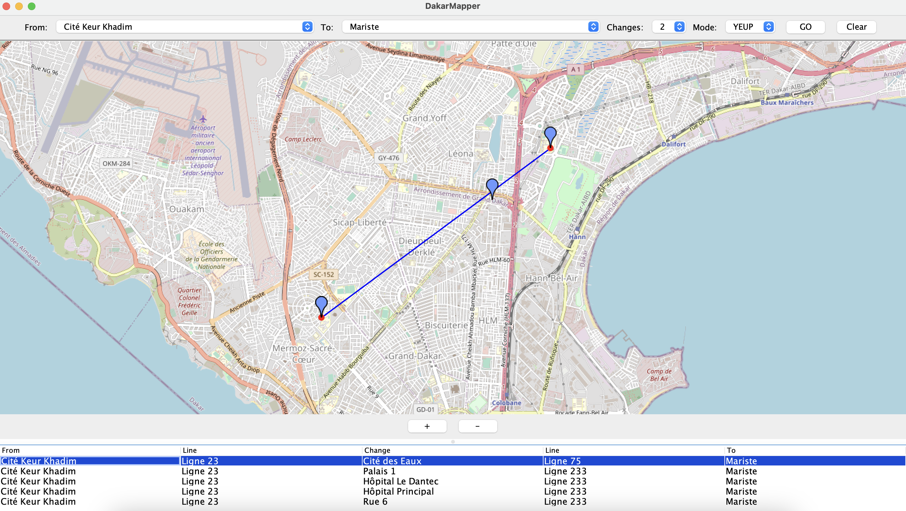
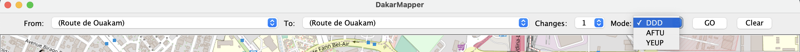
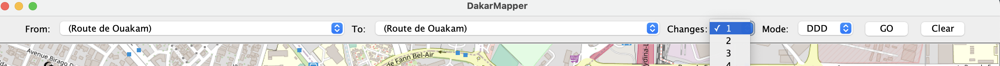
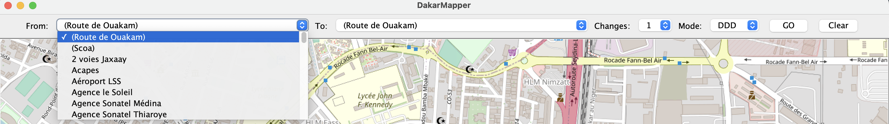
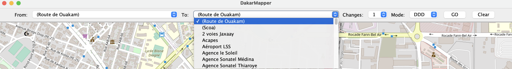

Debut d'un Vaste projet

 @author     Abdou Lahat SYLLA
 @version    1.0
 @since      August 2023

 
# DakarMapper

CityMapper Dakar est un projet de cartographie urbaine spécialement conçu pour la ville de Dakar, au Sénégal. 
Cette application permet aux utilisateurs de découvrir des informations détaillées sur les itinéraires de bus des fournisseurs DDD et AFTU, ainsi que d'autres informations utiles sur la ville.

## Table des matières

- [Aperçu](#aperçu)
- [Fonctionnalités](#fonctionnalités)
- [Captures d'écran](#captures-décran)
- [Installation](#installation)
- [Utilisation](#utilisation)
- [Contribuer](#contribuer)
- [Licence](#licence)

## Aperçu

CityMapper Dakar a été créé dans le but de faciliter les déplacements en bus dans la ville de Dakar. 
Il pourrait fournir des informations en temps réel sur les itinéraires avec les données au complets, les horaires et les arrêts de bus des fournisseurs DDD et AFTU, 
offrant ainsi une expérience de transport plus fluide aux résidents et aux visiteurs de Dakar.

## Fonctionnalités

- Affichage des horaires de bus en temps réel pour DDD et AFTU (possible avec les données au complet).
- Recherche d'itinéraires avec options de planification.
- click sur la map pour obtenir la station la plus proche
- Informations sur les arrêts de bus, y compris les emplacements et les services disponibles.
- Alertes pour les retards ou les perturbations de service (possible avec les données au complet).

## Captures d'écran











## Installation

Pour utiliser  Dakarmapper, suivez ces étapes d'installation :

1. Clonez ce dépôt sur votre ordinateur local :

   ```bash
   git clone https://github.com/AbdouLahatSYLLA/DakarMapper
   cd citymapper
   ```

2. creer une base de données mysql dans votre pc :
   ```CREATE DATABASE dakar_mapper ; ```
   ```SOURCE schema_sql/data/table.sql```
   ```SOURCE schema_sql/data/bus.sql ```
   ```SOURCE schema_sql/data/bon_stop_loc_aftu.sql ```
   ```SOURCE schema_sql/data/bon_stop_loc_ddd.sql ```


   

## Utilisation

Pour utiliser CityMapper Dakar, exécutez la commande suivante :

charger le projet avec intelliJ et executer l'application : App.java

cliquer sur la map pour choisir un point de depart et un point d'arriver ou choisir depuis les fromBoxe et toBoxe ensuite choisir le fournisseur de transport 'DDD' ou 'AFTU' ou   
   'YEUP' comme All pour designer tous les fournisseurs. Ensuite choisir le nombre de changement et cliquer sur 'GO' pour obtenir les itinéraires. En cliquant sur l'un des itinéraire on obtient le tracé de itineraire.

## Contribuer

Nous encourageons les contributions à DakarMapper.
Obtention des données GTFS complete aiderait à aller encore plus loin avec la possiblité de tracer les bus et d'obtenir les itineraires et horaires en temps reels. 

## Licence

CityMapper Dakar est distribué sous la licence MIT. 
